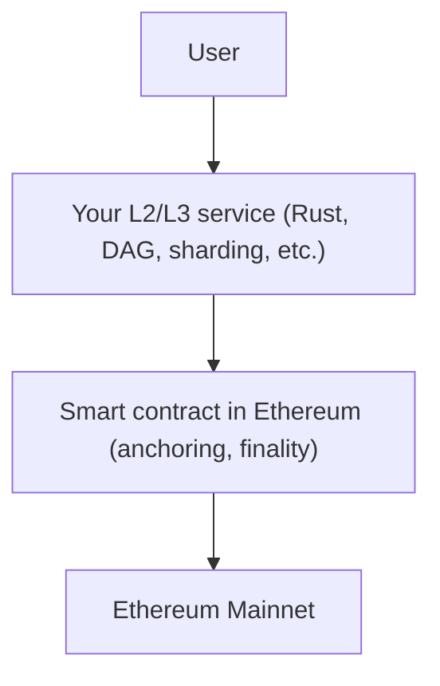

# Options for Building an Additional Layer (L2/L3) over Ethereum

## Briefly: What are L2 and L3?

- **L2 (Layer 2)** — solutions that operate on top of the main Ethereum network (L1) to improve scalability, reduce fees, and speed up transactions. Examples: Optimism, Arbitrum, zkSync.
- **L3 (Layer 3)** — solutions built on top of L2, usually for specialized tasks (e.g., privacy, custom rules, gaming networks, etc.).

---

## Options for an "Additional Layer" over Ethereum

### 1. Service Layer (off-chain)
- Your project works as a separate network/service that interacts with Ethereum via API, smart contracts, or events.
- Example: aggregator, indexer, off-chain computations, data storage that periodically synchronizes with Ethereum.

### 2. Custom Protocol on Top of Ethereum
- You implement your own logic (e.g., DAG, sharding, fast transactions) and periodically "anchor" the state in Ethereum for security and finality.
- Example: Plasma, Validium, commit-chain.

### 3. Rollup-like Solution
- Your project collects transactions, processes them off-chain, and then sends aggregated data or proofs to Ethereum.
- Example: Optimistic rollup, zk-rollup, or a simpler commit-chain.

---

## How to Implement This in Practice

- **Your project** (e.g., in Rust) works as a separate network/nodes, processes transactions, stores state, etc.
- **Interaction with Ethereum:**
  - Via web3/ethers-rs: sending transactions, calling smart contracts, reading state.
  - You can implement a smart contract in Ethereum that accepts "anchor" data (state roots, hashes, proofs).
- **Users** can interact with your layer directly, and for finality/trust — refer to Ethereum.

---

## Example Architecture

---

## Advantages of This Approach

- You can implement your own logic, not limited by EVM capabilities.
- Scalability and low fees for users.
- Security and finality via Ethereum.

---

## What You Need

1. **Library for working with Ethereum** (e.g., ethers-rs for Rust)
2. **Smart contract** for anchoring state (in Solidity)
3. **Synchronization logic** between your service and Ethereum

---

## Implementation Recommendations

- For Rust, there are libraries for working with Ethereum: [ethers-rs](https://github.com/gakonst/ethers-rs), [web3-rs](https://github.com/tomusdrw/rust-web3).
- You can connect these libraries and implement the required integration.
- For anchoring state, you will need to write a simple smart contract in Solidity that accepts hashes/state roots.
- It is important to consider how users can verify the correctness of data (e.g., via Merkle proof).

---

## If Needed:
- Example Rust code for sending data to Ethereum
- Example of a simple smart contract for anchoring state
- Explanation of such a layer's architecture

Let me know if you need specifics — I will prepare examples and step-by-step instructions! 